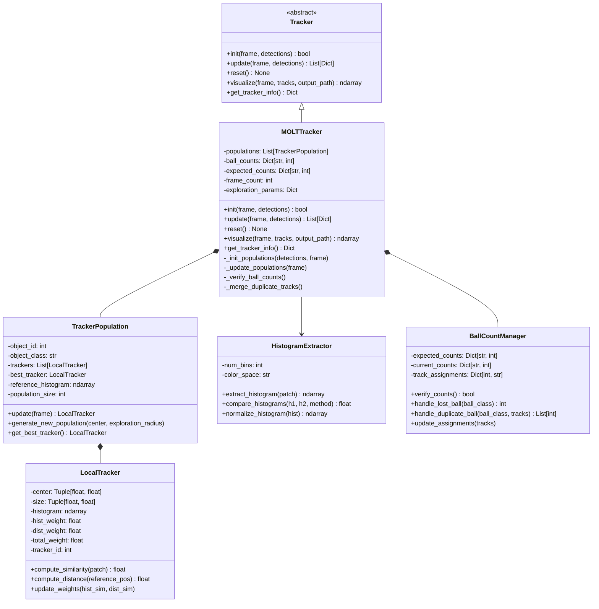
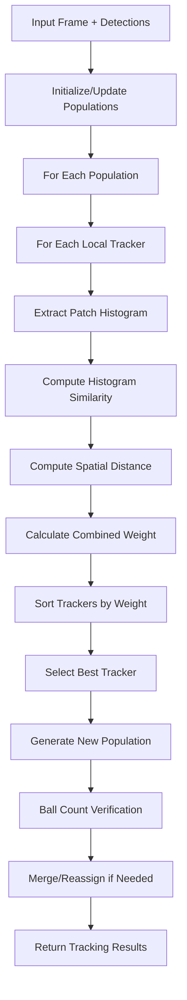

# Design Document

## Overview

The MOLT (Multiple Object Local Tracker) implementation will be a robust tracking algorithm specifically designed for tracking multiple small, similar objects in low-quality, low-frame-rate video. The system uses a population-based approach where each object is tracked by multiple local trackers that combine appearance features (color histograms) with motion constraints to maintain robust tracking even in challenging conditions.

The implementation will be placed in the PureCV directory as it uses traditional computer vision techniques and will implement the common tracker interface for seamless integration with the existing tracking infrastructure.

## Architecture

### Core Components



### Data Flow



## Components and Interfaces

### MOLTTracker Class

The main tracker class that implements the Tracker interface and orchestrates the population-based tracking.

**Key Methods:**
- `__init__(self, **kwargs)`: Initialize with configurable parameters
- `init(self, frame, detections)`: Set up initial populations from detections
- `update(self, frame, detections=None)`: Process new frame and return tracking results
- `_init_populations(self, detections, frame)`: Create initial tracker populations
- `_update_populations(self, frame)`: Update all populations for current frame
- `_verify_ball_counts(self)`: Check and correct ball count inconsistencies

**Configuration Parameters:**
- `population_sizes`: Dict mapping ball colors to population sizes
- `exploration_radii`: Dict mapping ball colors to search radii
- `histogram_bins`: Number of bins for color histograms
- `similarity_weights`: Weights for combining histogram and spatial similarities
- `expected_ball_counts`: Expected number of balls per color

### TrackerPopulation Class

Manages a population of local trackers for a single object.

**Key Methods:**
- `update(self, frame)`: Update all trackers and find best match
- `generate_new_population(self, center, exploration_radius)`: Create new tracker distribution
- `get_best_tracker(self)`: Return highest-weighted tracker
- `_diversity_strategy(self, trackers)`: Implement 50/30/20 distribution strategy

**Attributes:**
- `trackers`: List of LocalTracker instances
- `best_tracker`: Current best tracker
- `reference_histogram`: Initial appearance model
- `object_class`: Ball color/type

### LocalTracker Class

Individual tracker within a population that maintains position and appearance information.

**Key Methods:**
- `compute_similarity(self, patch)`: Calculate histogram similarity
- `compute_distance(self, reference_pos)`: Calculate spatial distance
- `update_weights(self, hist_sim, dist_sim)`: Combine similarities into total weight

**Attributes:**
- `center`: (x, y) position
- `size`: (width, height) dimensions
- `histogram`: Appearance model
- `total_weight`: Combined similarity score

### HistogramExtractor Class

Handles appearance feature extraction and comparison.

**Key Methods:**
- `extract_histogram(self, patch)`: Compute color histogram from image patch
- `compare_histograms(self, h1, h2, method='bhattacharyya')`: Compare two histograms
- `normalize_histogram(self, hist)`: Normalize histogram to unit sum

**Supported Distance Metrics:**
- Bhattacharyya distance
- Histogram intersection
- Chi-square distance

### BallCountManager Class

Manages ball counting and verification logic specific to snooker.

**Key Methods:**
- `verify_counts(self)`: Check if current counts match expectations
- `handle_lost_ball(self, ball_class)`: Process when a ball is lost
- `handle_duplicate_ball(self, ball_class, tracks)`: Resolve duplicate detections
- `update_assignments(self, tracks)`: Update track-to-ball-class mappings

**Ball Count Rules:**
- Red balls: 5-15 (configurable)
- Colored balls: Exactly 1 each (yellow, green, brown, blue, pink, black)
- White ball: Exactly 1

## Data Models

### Detection Format
```python
{
    'x': float,           # Center x coordinate
    'y': float,           # Center y coordinate
    'width': float,       # Bounding box width
    'height': float,      # Bounding box height
    'class': str,         # Ball color ('red', 'white', 'yellow', etc.)
    'class_id': int,      # Numeric class identifier
    'confidence': float   # Detection confidence [0, 1]
}
```

### Tracking Result Format
```python
{
    'id': int,                    # Unique track ID
    'x': float,                   # Center x coordinate
    'y': float,                   # Center y coordinate
    'width': float,               # Bounding box width
    'height': float,              # Bounding box height
    'class': str,                 # Ball color
    'class_id': int,              # Numeric class identifier
    'confidence': float,          # Tracking confidence
    'trail': List[Tuple[int, int]], # Position history
    'population_size': int,       # Number of trackers for this object
    'best_weight': float,         # Weight of best tracker
    'frames_tracked': int         # Number of frames tracked
}
```

### Configuration Schema
```python
{
    'population_sizes': {
        'white': 1500,      # Larger population for fast-moving white ball
        'red': 300,         # Medium population for red balls
        'yellow': 200,      # Smaller population for colored balls
        'green': 200,
        'brown': 200,
        'blue': 200,
        'pink': 200,
        'black': 200
    },
    'exploration_radii': {
        'white': 30,        # Larger search radius for white ball
        'red': 20,          # Medium radius for red balls
        'default': 15       # Default radius for other balls
    },
    'expected_ball_counts': {
        'white': 1,
        'red': 15,          # Configurable based on game state
        'yellow': 1,
        'green': 1,
        'brown': 1,
        'blue': 1,
        'pink': 1,
        'black': 1
    },
    'histogram_bins': 16,
    'similarity_weights': {
        'histogram': 0.6,   # Weight for appearance similarity
        'spatial': 0.4      # Weight for spatial consistency
    },
    'diversity_distribution': [0.5, 0.3, 0.2]  # Best, second, third tracker ratios
}
```

## Error Handling

### Tracking Failures
- **Lost Object**: When no tracker achieves minimum confidence, maintain last known position and increase exploration radius
- **Multiple Candidates**: Use ball count verification to resolve ambiguous assignments
- **Appearance Changes**: Gradually adapt reference histograms with exponential moving average

### Ball Count Violations
- **Too Many Balls**: Merge tracks with highest spatial overlap and appearance similarity
- **Too Few Balls**: Increase exploration radius and lower confidence thresholds for missing ball types
- **Impossible Counts**: Log warnings and attempt recovery through re-detection

### Edge Cases
- **Frame Boundaries**: Clip tracker positions to valid image coordinates
- **Empty Detections**: Continue tracking with motion prediction only
- **Initialization Failure**: Return empty results and log error details

## Testing Strategy

### Unit Tests
- **LocalTracker**: Test histogram computation, similarity calculations, weight updates
- **TrackerPopulation**: Test population generation, diversity strategies, best tracker selection
- **HistogramExtractor**: Test different distance metrics, normalization, edge cases
- **BallCountManager**: Test count verification, duplicate handling, assignment logic

### Integration Tests
- **MOLTTracker**: Test full tracking pipeline with synthetic data
- **Interface Compliance**: Verify adherence to Tracker abstract base class
- **Configuration**: Test various parameter combinations and edge values

### Performance Tests
- **Population Scaling**: Measure performance with different population sizes
- **Frame Rate**: Test tracking accuracy at various frame rates
- **Object Density**: Evaluate performance with different numbers of objects

### Validation Tests
- **Synthetic Data**: Test with generated sequences with known ground truth
- **Real Video**: Validate on actual snooker footage with manual annotations
- **Comparison**: Compare against existing trackers (DeepSORT, ByteTrack) on same data

## Performance Considerations

### Computational Complexity
- **Per Frame**: O(N × P × H) where N=objects, P=population size, H=histogram computation
- **Memory Usage**: Linear in total population size and histogram dimensions
- **Optimization**: Vectorized histogram operations, efficient patch extraction

### Scalability
- **Population Size**: Configurable per object type to balance accuracy vs. speed
- **Parallel Processing**: Populations can be updated independently
- **Memory Management**: Limit trail history and clean up old trackers

### Real-time Considerations
- **Target**: 30 FPS processing for standard video
- **Bottlenecks**: Histogram extraction and comparison
- **Optimizations**: Pre-computed lookup tables, reduced histogram bins for speed