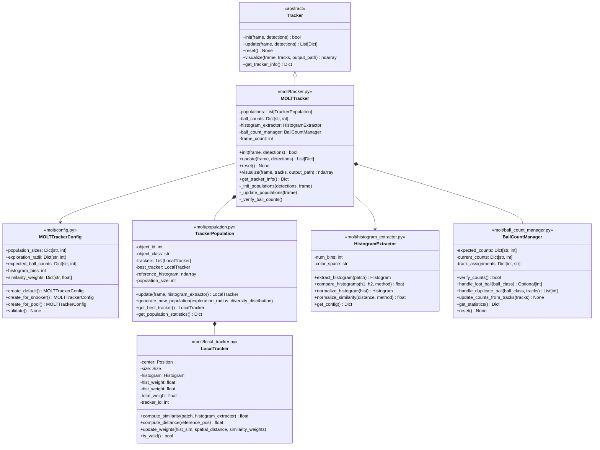
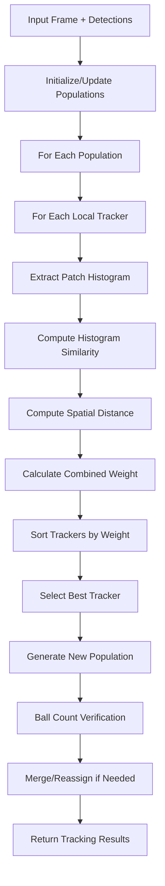

# Design Document

## Overview

The MOLT (Multiple Object Local Tracker) implementation will be a robust tracking algorithm specifically designed for tracking multiple small, similar objects in low-quality, low-frame-rate video. The system uses a population-based approach where each object is tracked by multiple local trackers that combine appearance features (color histograms) with motion constraints to maintain robust tracking even in challenging conditions.

The implementation is organized as a modular package in `PureCV/molt/` using traditional computer vision techniques. It implements the common tracker interface for seamless integration with the existing tracking infrastructure. The modular architecture separates concerns into focused components for better maintainability, testability, and reusability.

## Architecture

### Modular Architecture

The MOLT tracker is implemented as a modular package with clear separation of concerns:

```
PureCV/molt/
├── __init__.py              # Package exports (MOLTTracker, MOLTTrackerConfig)
├── tracker.py               # Main MOLTTracker class
├── population.py            # TrackerPopulation management
├── local_tracker.py         # Individual tracker logic
├── histogram_extractor.py   # Appearance feature extraction
├── ball_count_manager.py    # Count verification logic
├── config.py               # Configuration management
└── types.py                # Type definitions and constants
```

### Core Components



### Data Flow



## Components and Interfaces

### MOLTTracker Class (`molt/tracker.py`)

The main tracker class that implements the Tracker interface and orchestrates the population-based tracking.

**Key Methods:**
- `__init__(self, config=None, **kwargs)`: Initialize with MOLTTrackerConfig or kwargs
- `init(self, frame, detections)`: Set up initial populations from detections
- `update(self, frame, detections=None)`: Process new frame and return tracking results
- `visualize(self, frame, tracks, output_path=None)`: Create visualization with color-coded tracks
- `get_tracker_info(self)`: Return tracker information and statistics
- `_init_populations(self, detections, frame)`: Create initial tracker populations
- `_update_populations(self, frame)`: Update all populations for current frame
- `_verify_ball_counts(self)`: Check and correct ball count inconsistencies

**Usage:**
```python
from tracking.trackers.molt import MOLTTracker, MOLTTrackerConfig

# With default configuration
tracker = MOLTTracker()

# With custom configuration
config = MOLTTrackerConfig.create_for_snooker()
tracker = MOLTTracker(config=config)

# With parameter overrides
tracker = MOLTTracker(histogram_bins=16, color_space='RGB')
```

### MOLTTrackerConfig Class (`molt/config.py`)

Configuration management with validation and presets.

**Key Methods:**
- `create_default()`: Create default configuration
- `create_for_snooker()`: Create snooker-optimized configuration
- `create_for_pool()`: Create pool/billiards-optimized configuration
- `validate()`: Validate all configuration parameters
- `to_dict()`: Convert to dictionary format

**Configuration Parameters:**
- `population_sizes`: Dict mapping ball colors to population sizes
- `exploration_radii`: Dict mapping ball colors to search radii
- `histogram_bins`: Number of bins for color histograms
- `similarity_weights`: Weights for combining histogram and spatial similarities
- `expected_ball_counts`: Expected number of balls per color
- `color_space`: Color space for histogram extraction ('HSV', 'RGB', 'LAB')
- `min_confidence`: Minimum confidence threshold
- `max_frames_without_detection`: Maximum frames to track without detection

### TrackerPopulation Class (`molt/population.py`)

Manages a population of local trackers for a single object with diversity strategies.

**Key Methods:**
- `update(self, frame, histogram_extractor, similarity_weights)`: Update all trackers and find best match
- `generate_new_population(self, exploration_radius, diversity_distribution)`: Create new tracker distribution with 50/30/20 strategy
- `get_best_tracker(self)`: Return highest-weighted tracker
- `get_top_trackers(self, n=3)`: Get top N trackers for diversity generation
- `get_population_statistics(self)`: Get detailed population statistics
- `reset(self)`: Reset population state while preserving configuration
- `is_valid(self)`: Check if population is in valid state

**Attributes:**
- `trackers`: List of LocalTracker instances
- `best_tracker`: Current best tracker
- `reference_histogram`: Initial appearance model
- `object_class`: Ball color/type
- `population_size`: Number of trackers in population
- `frame_count`: Number of frames processed
- `best_weights_history`: History of best tracker weights

### LocalTracker Class (`molt/local_tracker.py`)

Individual tracker within a population that maintains position and appearance information with enhanced validation.

**Key Methods:**
- `compute_similarity(self, patch, histogram_extractor, method='bhattacharyya')`: Calculate histogram similarity
- `compute_distance(self, reference_pos)`: Calculate spatial distance
- `update_weights(self, hist_similarity, spatial_distance, similarity_weights, max_distance=100.0)`: Combine similarities into total weight
- `update_position(self, new_center)`: Update tracker position
- `update_size(self, new_size)`: Update tracker size
- `update_histogram(self, new_histogram)`: Update reference histogram
- `get_bounding_box(self)`: Get bounding box coordinates
- `get_corner_bounding_box(self)`: Get corner-based bounding box
- `is_valid(self)`: Check if tracker is in valid state
- `get_state_dict(self)`: Get tracker state as dictionary

**Attributes:**
- `center`: (x, y) position as Position type
- `size`: (width, height) dimensions as Size type
- `histogram`: Appearance model as Histogram type
- `hist_weight`: Histogram similarity weight
- `dist_weight`: Spatial distance weight
- `total_weight`: Combined similarity score
- `confidence`: Tracking confidence based on total weight
- `tracker_id`: Unique identifier within population

### HistogramExtractor Class (`molt/histogram_extractor.py`)

Handles appearance feature extraction and comparison with multiple color spaces and distance metrics.

**Key Methods:**
- `extract_histogram(self, patch)`: Compute color histogram from image patch
- `compare_histograms(self, h1, h2, method='bhattacharyya')`: Compare two histograms
- `normalize_histogram(self, hist)`: Normalize histogram to unit sum
- `normalize_similarity(self, distance, method='bhattacharyya')`: Map distance to similarity [0,1]
- `get_config(self)`: Get current extractor configuration

**Supported Color Spaces:**
- HSV (default): Better for color-based tracking
- RGB: Standard color representation
- LAB: Perceptually uniform color space

**Supported Distance Metrics:**
- Bhattacharyya distance (default): Robust statistical measure
- Histogram intersection: Fast and intuitive
- Chi-square distance: Good for normalized histograms

**Configuration:**
```python
from tracking.trackers.molt.histogram_extractor import HistogramExtractor

# Default configuration
extractor = HistogramExtractor()

# Custom configuration
extractor = HistogramExtractor(num_bins=32, color_space='LAB')
```

### BallCountManager Class (`molt/ball_count_manager.py`)

Manages ball counting and verification logic specific to snooker with comprehensive violation handling.

**Key Methods:**
- `verify_counts(self)`: Check if current counts match expectations
- `handle_lost_ball(self, ball_class)`: Process when a ball is lost
- `handle_duplicate_ball(self, ball_class, track_ids)`: Resolve duplicate detections
- `update_counts_from_tracks(self, tracks)`: Update current counts from tracking results
- `suggest_track_merges(self, tracks)`: Suggest track pairs for merging
- `get_count_violations(self)`: Get detailed violation information
- `get_statistics(self)`: Get comprehensive statistics
- `reset(self)`: Reset manager state
- `update_expected_counts(self, new_expected_counts)`: Update expected counts (e.g., when balls are potted)

**Ball Count Rules:**
- Red balls: 0-15 (configurable based on game state)
- Colored balls: Exactly 1 each (yellow, green, brown, blue, pink, black)
- White ball: Exactly 1

**Violation Handling:**
- **Over-count**: Suggests track merging based on spatial proximity
- **Under-count**: Attempts track recovery and reassignment
- **Statistics**: Tracks violation history and recovery attempts

## Data Models

### Detection Format
```python
{
    'x': float,           # Center x coordinate
    'y': float,           # Center y coordinate
    'width': float,       # Bounding box width
    'height': float,      # Bounding box height
    'class': str,         # Ball color ('red', 'white', 'yellow', etc.)
    'class_id': int,      # Numeric class identifier
    'confidence': float   # Detection confidence [0, 1]
}
```

### Tracking Result Format
```python
{
    'id': int,                    # Unique track ID
    'x': float,                   # Center x coordinate
    'y': float,                   # Center y coordinate
    'width': float,               # Bounding box width
    'height': float,              # Bounding box height
    'class': str,                 # Ball color
    'class_id': int,              # Numeric class identifier
    'confidence': float,          # Tracking confidence
    'trail': List[Tuple[int, int]], # Position history
    'population_size': int,       # Number of trackers for this object
    'best_weight': float,         # Weight of best tracker
    'frames_tracked': int         # Number of frames tracked
}
```

### Configuration Schema
```python
{
    'population_sizes': {
        'white': 1500,      # Larger population for fast-moving white ball
        'red': 300,         # Medium population for red balls
        'yellow': 200,      # Smaller population for colored balls
        'green': 200,
        'brown': 200,
        'blue': 200,
        'pink': 200,
        'black': 200
    },
    'exploration_radii': {
        'white': 30,        # Larger search radius for white ball
        'red': 20,          # Medium radius for red balls
        'default': 15       # Default radius for other balls
    },
    'expected_ball_counts': {
        'white': 1,
        'red': 15,          # Configurable based on game state
        'yellow': 1,
        'green': 1,
        'brown': 1,
        'blue': 1,
        'pink': 1,
        'black': 1
    },
    'histogram_bins': 16,
    'similarity_weights': {
        'histogram': 0.6,   # Weight for appearance similarity
        'spatial': 0.4      # Weight for spatial consistency
    },
    'diversity_distribution': [0.5, 0.3, 0.2]  # Best, second, third tracker ratios
}
```

## Error Handling

### Tracking Failures
- **Lost Object**: When no tracker achieves minimum confidence, maintain last known position and increase exploration radius
- **Multiple Candidates**: Use ball count verification to resolve ambiguous assignments
- **Appearance Changes**: Gradually adapt reference histograms with exponential moving average

### Ball Count Violations
- **Too Many Balls**: Merge tracks with highest spatial overlap and appearance similarity
- **Too Few Balls**: Increase exploration radius and lower confidence thresholds for missing ball types
- **Impossible Counts**: Log warnings and attempt recovery through re-detection

### Edge Cases
- **Frame Boundaries**: Clip tracker positions to valid image coordinates
- **Empty Detections**: Continue tracking with motion prediction only
- **Initialization Failure**: Return empty results and log error details

## Modular Architecture Benefits

### Maintainability
- **Focused Modules**: Each component has a single responsibility
- **Clear Interfaces**: Well-defined APIs between components
- **Independent Development**: Components can be modified without affecting others
- **Code Navigation**: Easy to find and understand specific functionality

### Testability
- **Unit Testing**: Each component can be tested in isolation
- **Mock Dependencies**: Easy to mock interfaces for focused testing
- **Integration Testing**: Components can be tested together systematically
- **Test Organization**: Tests are organized by component and functionality

### Reusability
- **Component Import**: Individual components can be imported independently
- **Configuration Flexibility**: Multiple configuration options and presets
- **Extension Points**: Easy to extend or replace individual components
- **API Consistency**: Consistent interfaces across all components

### Type Safety
- **Centralized Types**: All type definitions in `types.py`
- **Generic Support**: Proper generic types for collections
- **Strict Typing**: Full mypy compliance with strict optional checking
- **Runtime Validation**: Configuration validation and error handling

## Testing Strategy

### Unit Tests
- **MOLTTrackerConfig** (`test_config.py`): Configuration validation, presets, serialization
- **HistogramExtractor** (`test_histogram_extractor.py`): Distance metrics, normalization, color spaces, edge cases
- **LocalTracker**: Histogram computation, similarity calculations, weight updates, validation
- **TrackerPopulation**: Population generation, diversity strategies, best tracker selection, statistics
- **BallCountManager**: Count verification, duplicate handling, assignment logic, violation handling

### Integration Tests (`test_integration.py`)
- **Component Integration**: Test that all components work together correctly
- **MOLTTracker with Configuration**: Test tracker with custom configurations
- **Parameter Override**: Test kwargs override functionality
- **Visualization**: Test tracking result visualization
- **Error Handling**: Test graceful failure modes and edge cases
- **Interface Compliance**: Verify adherence to Tracker abstract base class

### Test Execution
```bash
# Run all tests
python PureCV/run_all_tests.py

# Run specific test suites
python PureCV/tests/test_config.py
python PureCV/tests/test_histogram_extractor.py
python PureCV/tests/test_integration.py

# Run examples
python PureCV/examples/basic_usage.py
```

### Quality Metrics
- **Type Safety**: 100% mypy compliance with strict optional checking
- **Test Coverage**: 7/7 test suites passing (100% success rate)
- **Performance**: All tests complete in <1 second
- **Documentation**: Comprehensive examples and usage patterns

## Performance Considerations

### Computational Complexity
- **Per Frame**: O(N × P × H) where N=objects, P=population size, H=histogram computation
- **Memory Usage**: Linear in total population size and histogram dimensions
- **Optimization**: Vectorized histogram operations, efficient patch extraction

### Scalability
- **Population Size**: Configurable per object type to balance accuracy vs. speed
- **Parallel Processing**: Populations can be updated independently
- **Memory Management**: Limit trail history and clean up old trackers

### Real-time Considerations
- **Target**: 30 FPS processing for standard video
- **Bottlenecks**: Histogram extraction and comparison
- **Optimizations**: Pre-computed lookup tables, reduced histogram bins for speed