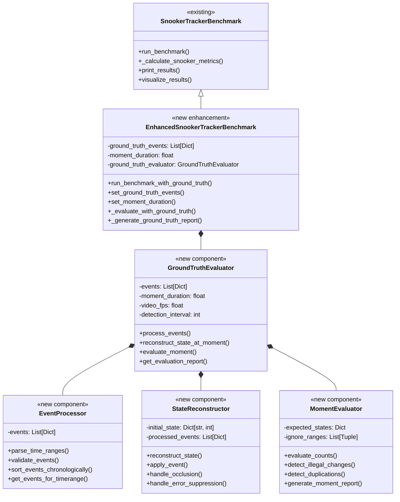
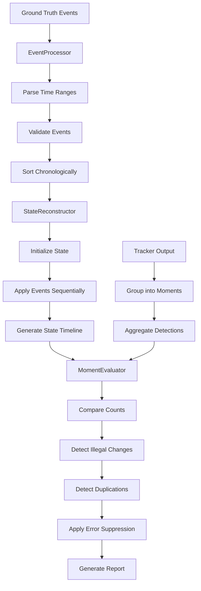

# Design Document

## Overview

The enhanced SnookerTrackerBenchmark adds event-based ground truth evaluation capabilities to the existing benchmark system. This enhancement introduces sparse, temporal event annotations that describe game state changes (ball potting, placement, occlusion) and provides comprehensive evaluation metrics comparing tracker output against reconstructed ground truth states.

The design extends the existing SnookerTrackerBenchmark class with new components for event processing, state reconstruction, moment-based evaluation, and detailed error analysis. The system maintains full backward compatibility while adding powerful new evaluation capabilities for snooker tracking research.

## Architecture

### Enhanced Class Structure



### Data Flow Architecture



## Components and Interfaces

### EnhancedSnookerTrackerBenchmark Class

Extends the existing SnookerTrackerBenchmark with ground truth evaluation capabilities.

**New Methods:**

```python
def set_ground_truth_events(self, events: List[Dict]) -> None:
    """Set ground truth events for evaluation."""

def set_moment_duration(self, duration: float) -> None:
    """Set temporal granularity for evaluation."""

def run_benchmark_with_ground_truth(self, video_path: str,
                                   ground_truth_events: List[Dict],
                                   moment_duration: float = 0.5,
                                   **kwargs) -> Dict:
    """Run benchmark with ground truth evaluation."""
```

**Enhanced Results Structure:**

```python
{
    'tracker_name': {
        # Existing metrics
        'processing_time': float,
        'avg_fps': float,
        'metrics': {...},
        'snooker_metrics': {...},

        # New ground truth metrics
        'ground_truth_metrics': {
            'overall_accuracy': float,
            'per_ball_accuracy': Dict[str, float],
            'count_errors': {
                'over_detection': List[Dict],
                'under_detection': List[Dict],
                'total_errors': int
            },
            'illegal_changes': {
                'disappearances': List[Dict],
                'reappearances': List[Dict],
                'total_illegal': int
            },
            'duplication_errors': List[Dict],
            'temporal_analysis': {
                'error_rate_over_time': List[float],
                'high_error_periods': List[Tuple]
            }
        }
    }
}
```

### GroundTruthEvaluator Class

Core component that orchestrates the ground truth evaluation process.

**Key Methods:**

```python
def __init__(self, events: List[Dict], moment_duration: float,
             video_fps: float, detection_interval: int):
    """Initialize evaluator with events and video parameters."""

def process_events(self) -> None:
    """Process and validate all ground truth events."""

def reconstruct_state_at_moment(self, moment_idx: int) -> Dict[str, int]:
    """Reconstruct expected ball state for a specific moment."""

def evaluate_moment(self, moment_idx: int, detected_counts: Dict[str, int],
                   detected_positions: List[Dict]) -> Dict:
    """Evaluate tracker output for a single moment."""

def get_evaluation_report(self) -> Dict:
    """Generate comprehensive evaluation report."""
```

### EventProcessor Class

Handles parsing, validation, and organization of ground truth events.

**Event Format Support:**

```python
# Point events (time in seconds into video)
{"time": 42.0, "ball_potted": "red"}  # 42 seconds into video
{"frame": 1250, "ball_placed_back": "black"}  # Frame number

# Range events (time ranges in seconds into video)
{"time_range": "120-125", "balls_occluded": {"reds": 2, "blue": 1}}  # 120-125 seconds
{"frame_range": "1000-1150", "ignore_errors": "view_not_clear"}  # Frame range

# Initial state (at video start)
{"time": 0, "reds": 15, "yellow": 1, "green": 1, "brown": 1,
 "blue": 1, "pink": 1, "black": 1}  # Initial state at 0 seconds
```

**Key Methods:**

```python
def parse_time_ranges(self, event: Dict) -> Tuple[float, float]:
    """Parse time range strings like '120-125' into start/end times."""

def validate_events(self, events: List[Dict]) -> List[str]:
    """Validate event format and return any errors."""

def sort_events_chronologically(self, events: List[Dict]) -> List[Dict]:
    """Sort events by time/frame for sequential processing."""

def get_events_for_timerange(self, start_time: float, end_time: float) -> List[Dict]:
    """Get all events that affect a specific time range."""
```

### StateReconstructor Class

Reconstructs expected ball states from sparse events.

**State Management:**

```python
# Internal state representation
{
    'reds': 15,
    'yellow': 1,
    'green': 1,
    'brown': 1,
    'blue': 1,
    'pink': 1,
    'black': 1,
    'white': 1,
    'occluded': {  # Temporarily hidden balls
        'reds': 0,
        'blue': 0
    },
    'ignore_errors': False  # Error suppression flag
}
```

**Key Methods:**

```python
def reconstruct_state(self, target_time: float) -> Dict[str, int]:
    """Reconstruct complete state at target time."""

def apply_event(self, event: Dict, current_state: Dict) -> Dict:
    """Apply single event to current state."""

def handle_occlusion(self, event: Dict, state: Dict) -> Dict:
    """Handle ball occlusion events."""

def handle_error_suppression(self, event: Dict, state: Dict) -> Dict:
    """Handle error suppression events."""
```

### MomentEvaluator Class

Evaluates tracker output against expected states for individual moments.

**Evaluation Types:**

1. **Count Comparison**: Compare detected vs expected ball counts
2. **Illegal Change Detection**: Identify disappearances/reappearances without events
3. **Duplication Detection**: Find multiple objects of same type too close together
4. **Error Suppression**: Skip evaluation during marked periods

**Key Methods:**

```python
def evaluate_counts(self, expected: Dict[str, int],
                   detected: Dict[str, int]) -> Dict:
    """Compare expected vs detected ball counts."""

def detect_illegal_changes(self, prev_detected: Dict,
                          curr_detected: Dict,
                          expected_changes: List[str]) -> Dict:
    """Detect tracking changes not explained by events."""

def detect_duplications(self, detected_positions: List[Dict],
                       distance_threshold: float = 50.0) -> List[Dict]:
    """Detect duplicate objects of same type."""

def generate_moment_report(self, moment_idx: int,
                          evaluation_results: Dict) -> Dict:
    """Generate detailed report for single moment."""
```

## Data Models

### Ground Truth Event Schema

```python
# Event types and their schemas
EventSchema = Union[
    # Initial state
    {
        "time": 0,
        "reds": int,
        "yellow": int,
        "green": int,
        "brown": int,
        "blue": int,
        "pink": int,
        "black": int,
        "white": int
    },

    # Ball potting
    {
        "time": float,  # seconds into video (or "frame": int)
        "ball_potted": str  # ball color
    },

    # Ball placement
    {
        "time": float,  # seconds into video (or "frame": int)
        "ball_placed_back": str  # ball color
    },

    # Occlusion (range event)
    {
        "time_range": str,  # "start-end" format in seconds (e.g., "120-125")
        "balls_occluded": Dict[str, int]  # ball counts temporarily hidden
    },

    # Error suppression (range event)
    {
        "time_range": str,  # "start-end" format in seconds (e.g., "130-135")
        "ignore_errors": str  # reason for suppression
    }
]
```

### Moment Structure

```python
MomentData = {
    'moment_idx': int,
    'start_time': float,
    'end_time': float,
    'start_frame': int,
    'end_frame': int,
    'frames_in_moment': List[int],
    'aggregated_detections': Dict[str, int],  # Ball type -> count
    'detection_positions': List[Dict],  # Individual detection positions
    'expected_state': Dict[str, int],  # Expected ball counts
    'ignore_errors': bool  # Whether to suppress errors for this moment
}
```

### Evaluation Result Schema

```python
EvaluationResult = {
    'moment_idx': int,
    'timestamp': float,
    'count_evaluation': {
        'ball_type': str,
        'expected': int,
        'detected': int,
        'error_type': str,  # 'over_detection', 'under_detection', 'correct'
        'error_magnitude': int
    },
    'illegal_changes': List[{
        'change_type': str,  # 'disappearance', 'reappearance'
        'ball_type': str,
        'previous_count': int,
        'current_count': int
    }],
    'duplication_errors': List[{
        'ball_type': str,
        'positions': List[Tuple[float, float]],
        'distances': List[float]
    }],
    'suppressed': bool  # Whether errors were suppressed
}
```

## Error Handling

### Event Validation

```python
def validate_event(event: Dict) -> List[str]:
    """Validate single event and return error messages."""
    errors = []

    # Check time specification
    time_keys = ['time', 'frame', 'time_range', 'frame_range']
    if not any(key in event for key in time_keys):
        errors.append("Event must specify time, frame, time_range, or frame_range")

    # Validate time ranges
    if 'time_range' in event:
        try:
            start, end = event['time_range'].split('-')
            if float(end) <= float(start):
                errors.append("End time must be greater than start time")
        except ValueError:
            errors.append("Invalid time_range format, use 'start-end'")

    # Validate ball types
    valid_balls = {'red', 'yellow', 'green', 'brown', 'blue', 'pink', 'black', 'white'}
    for key, value in event.items():
        if key in ['ball_potted', 'ball_placed_back'] and value not in valid_balls:
            errors.append(f"Invalid ball type: {value}")

    return errors
```

### State Reconstruction Errors

- **Missing Initial State**: Default to standard snooker setup (15 reds, 6 colors, 1 white)
- **Impossible States**: Log warnings for negative ball counts or excessive counts
- **Event Conflicts**: Resolve by chronological order, later events override earlier ones
- **Time Gaps**: Maintain last known state until next event

### Evaluation Errors

- **Missing Tracker Data**: Skip moments without tracker output
- **Invalid Detections**: Filter out detections with invalid coordinates or classes
- **Moment Boundary Issues**: Handle frames that span moment boundaries
- **Performance Degradation**: Limit evaluation to reasonable video lengths

## Testing Strategy

### Unit Tests

1. **EventProcessor Tests**

   - Time range parsing
   - Event validation
   - Chronological sorting
   - Event filtering by time range

2. **StateReconstructor Tests**

   - Initial state setup
   - Event application
   - Occlusion handling
   - Error suppression
   - State interpolation

3. **MomentEvaluator Tests**
   - Count comparison accuracy
   - Illegal change detection
   - Duplication detection
   - Error suppression application

### Integration Tests

1. **End-to-End Evaluation**

   - Complete benchmark with ground truth
   - Multiple tracker comparison
   - Report generation
   - Visualization output

2. **Edge Case Handling**
   - Empty ground truth
   - Malformed events
   - Video/event time mismatches
   - Extreme ball counts

### Performance Tests

1. **Scalability**

   - Long videos (>10 minutes)
   - Many events (>100 events)
   - High frame rates
   - Multiple trackers

2. **Memory Usage**
   - Large tracker outputs
   - Detailed position data
   - Report generation

## Performance Considerations

### Computational Complexity

- **Event Processing**: O(E log E) where E = number of events (for sorting)
- **State Reconstruction**: O(E) per moment lookup
- **Moment Evaluation**: O(M × D) where M = moments, D = detections per moment
- **Overall**: O(M × D + E log E) for complete evaluation

### Memory Optimization

- **Lazy State Reconstruction**: Only compute states when needed
- **Streaming Evaluation**: Process moments incrementally
- **Result Compression**: Store only essential evaluation data
- **Garbage Collection**: Clean up intermediate data structures

### Real-time Considerations

- **Batch Processing**: Group moment evaluations for efficiency
- **Parallel Evaluation**: Independent moment evaluation allows parallelization
- **Progress Reporting**: Provide feedback for long evaluations
- **Early Termination**: Allow cancellation of long-running evaluations

## Visualization Enhancements

### New Visualization Components

1. **Ground Truth Timeline**

   - Event markers on time axis
   - State changes visualization
   - Error suppression periods

2. **Accuracy Over Time**

   - Per-ball-type accuracy trends
   - Error rate visualization
   - High-error period highlighting

3. **Error Distribution**

   - Error type breakdown
   - Spatial error patterns
   - Temporal error clustering

4. **Comparative Analysis**
   - Multi-tracker ground truth comparison
   - Relative performance metrics
   - Best/worst performance periods

### Enhanced Report Generation

```python
def generate_comprehensive_report(self) -> Dict:
    """Generate detailed evaluation report with visualizations."""
    return {
        'summary': {
            'total_moments': 1200,
            'total_duration': 600.0,  # seconds
            'overall_accuracy': 87.5,  # percentage
            'total_errors': 45,
            'evaluation_duration': 12.3  # processing time
        },
        'moment_by_moment_results': [
            {
                'moment_idx': 0,
                'timestamp': 0.5,  # seconds into video
                'expected_counts': {'red': 15, 'yellow': 1, 'green': 1, 'blue': 1, 'pink': 1, 'black': 1, 'white': 1},
                'detected_counts': {'red': 14, 'yellow': 1, 'green': 1, 'blue': 1, 'pink': 1, 'black': 1, 'white': 1},
                'errors': [
                    {
                        'type': 'under_detection',
                        'ball_type': 'red',
                        'expected': 15,
                        'detected': 14,
                        'magnitude': 1,
                        'context': 'stable_period'  # or 'transition_period'
                    }
                ],
                'illegal_changes': [],
                'duplications': [],
                'suppressed': False
            },
            {
                'moment_idx': 84,  # Around 42 seconds (moment_duration=0.5)
                'timestamp': 42.0,
                'expected_counts': {'red': 14, 'yellow': 1, 'green': 1, 'blue': 1, 'pink': 1, 'black': 1, 'white': 1},
                'detected_counts': {'red': 14, 'yellow': 1, 'green': 1, 'blue': 1, 'pink': 1, 'black': 1, 'white': 1},
                'errors': [],
                'illegal_changes': [],
                'duplications': [],
                'suppressed': False,
                'event_context': {
                    'active_events': [
                        {
                            'type': 'ball_potted',
                            'ball_type': 'red',
                            'time_range': '41.5-42.5',
                            'phase': 'during'  # before/during/after
                        }
                    ]
                }
            }
        ],
        'per_ball_analysis': {
            'red': {
                'total_moments': 1200,
                'correct_moments': 1050,
                'accuracy': 87.5,
                'over_detections': 12,
                'under_detections': 138,
                'illegal_disappearances': 3,
                'illegal_reappearances': 2,
                'avg_error_magnitude': 1.2
            },
            'white': {
                'total_moments': 1200,
                'correct_moments': 1180,
                'accuracy': 98.3,
                'over_detections': 5,
                'under_detections': 15,
                'illegal_disappearances': 8,
                'illegal_reappearances': 7,
                'avg_error_magnitude': 0.8
            }
        },
        'temporal_analysis': {
            'error_timeline': [
                (0.0, 1),    # (timestamp, error_count)
                (0.5, 0),
                (1.0, 2),
                # ... more data points
            ],
            'high_error_periods': [
                (120.0, 125.0, 'balls_occluded_event'),
                (240.0, 245.0, 'multiple_ball_interactions'),
                (380.0, 385.0, 'poor_lighting_conditions')
            ],
            'accuracy_by_time': [
                (0.0, 95.0),   # (timestamp, accuracy_percentage)
                (30.0, 92.0),
                (60.0, 88.0),
                # ... more data points
            ]
        },
        'error_breakdown': {
            'count_errors': {
                'over_detection': 25,
                'under_detection': 180,
                'total': 205
            },
            'illegal_changes': {
                'disappearances': 15,
                'reappearances': 12,
                'total': 27
            },
            'duplications': 8,
            'suppressed_moments': 24  # moments where errors were ignored
        },
        'event_analysis': {
            'total_events': 12,
            'events_with_errors': 3,
            'transition_period_accuracy': 82.1,
            'stable_period_accuracy': 89.3,
            'event_breakdown': [
                {
                    'event': {'time_range': '41.5-42.5', 'ball_potted': 'red'},
                    'before_accuracy': 95.0,
                    'during_accuracy': 85.0,
                    'after_accuracy': 90.0,
                    'errors_during_transition': 2
                }
            ]
        },
        'recommendations': [
            'Red ball tracking shows consistent under-detection (138 instances)',
            'Consider tuning detection threshold for red balls',
            'White ball has frequent illegal disappearances (8 instances) - check motion prediction',
            'High error period at 120-125s corresponds to occlusion event - expected behavior',
            'Overall accuracy of 87.5% is good, focus on red ball detection improvements'
        ]
    }
```

### Example Console Output

```
===== GROUND TRUTH EVALUATION RESULTS =====

Video Duration: 600.0 seconds (1200 moments @ 0.5s each)
Overall Accuracy: 87.5%
Total Errors: 45 (3.75% error rate)

=== Per-Ball Analysis ===
Ball Type    | Accuracy | Over-Det | Under-Det | Illegal Changes
-------------|----------|----------|-----------|----------------
red          |   87.5%  |    12    |    138    |       5
white        |   98.3%  |     5    |     15    |      15
yellow       |   99.1%  |     2    |      8    |       1
green        |   98.8%  |     1    |     12    |       2
brown        |   99.2%  |     0    |      7    |       1
blue         |   97.9%  |     3    |     18    |       3
pink         |   98.5%  |     1    |     14    |       2
black        |   96.7%  |     1    |     28    |       5

=== Event Analysis ===
Total Events: 12
Events with Errors: 3 (25.0%)
Transition Period Accuracy: 82.1%
Stable Period Accuracy: 89.3%

Event: ball_potted:red @ 41.5-42.5s
  Before: 95.0% | During: 85.0% | After: 90.0%
  Errors during transition: 2

=== High Error Periods ===
120.0-125.0s: balls_occluded_event (Expected - suppressed)
240.0-245.0s: multiple_ball_interactions (15 errors)
380.0-385.0s: poor_lighting_conditions (12 errors)

=== Recommendations ===
• Red ball tracking shows consistent under-detection (138 instances)
• Consider tuning detection threshold for red balls
• White ball has frequent illegal disappearances - check motion prediction
• Focus on improving performance during ball interaction periods
```

This design provides a comprehensive enhancement to the SnookerTrackerBenchmark that maintains backward compatibility while adding powerful ground truth evaluation capabilities. The modular architecture allows for easy testing, maintenance, and future extensions.
